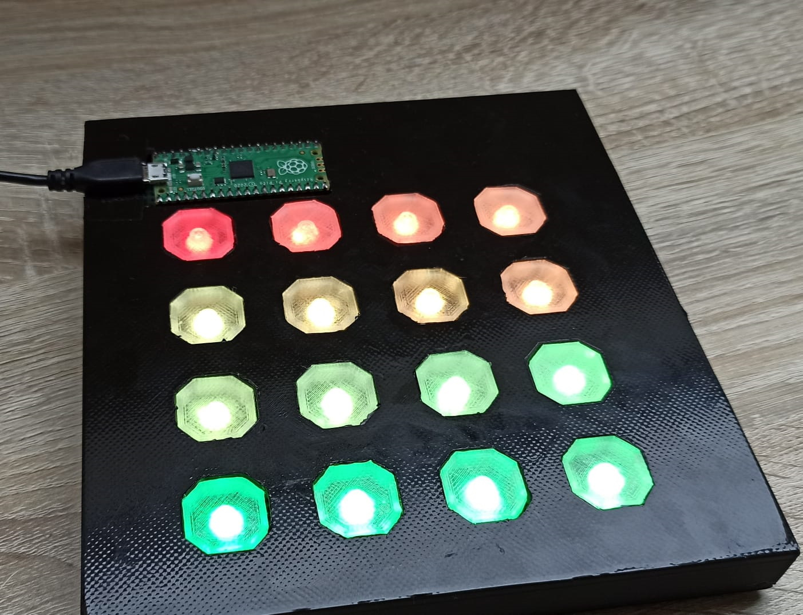
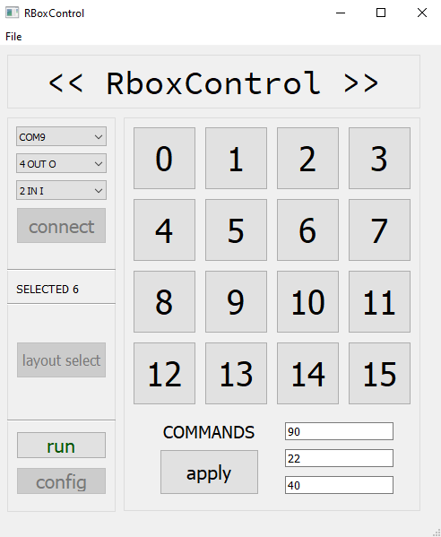

# Project RBOX
##### Launchpad / keypad with a RP2040 Raspberry Pi Pico
This is a launchpad project which is intended to be used with software like FL Studio. It can also be used as a keypad, it is specifically tested with Windows 10.

#### Where can it be used?

I designed and tested it with FL Studio 20. In performance mode it can be directly used as a launchpad when the midi bytes are adjusted. It can also recieve and display RGB signals from FL Studio when the launchpad type is set to `Novation Launchpad` in the MIDI settings.

It can also be used as a regular keypad or StremDeck in keypad mode.

This Readme will cover the harware part and the software part:

## The Hardware (RBOXLaunchpad)

#### PCB

The launchpad itself is 3D printed. The .stl files and in the `CAD` folder. The PCB is two-layered. The buttons are soldered onto the PCB and then the WS2812E modules are mounted on the buttons itself. Each button has its own pin for better maintenance and IRQ support. They share a common ground.

#### Case

The case consists of 18 parts. 16 buttons and 2 parts of the shell. The shell parts are black PLA and the buttons are transparent PET. The buttons are glued on the WS2812E modules. I designed it this way so that the LED only illuminates the button and the light is distributed evenly. When the button is pressed, it will push the LED onto the button - triggering a signal.

#### Microcontroller

I used the Raspberry Pi Pico *(RP2040 chip)* with micropython. It is a cheap *(4€)* microyontroller that has all the features needed. The firmware is programmed in C with the SDK provided by Raspberry. The Pi communicates to the PC via a serial connection. The prototyping firmware written in Micropython is in the old_py folder in device. The new firmware source code is in `device/rbox`. Also, the .uf2 firmware is in the releases tab

#### Image:

## The Software (RBOXControl)
#### Description:

##### LAUNCHPAD MODE

The software is a driver/bridge between the launchpad and FL Studio. It can also be used as a configuration software instead of editing the .json directly. The program is plit up into two sides.

The right side is used for configuration when the engines are not running. The 3 bytes below the buttons are entered in hex format. Clicking on apply will write the changes directly into the `config.json` file.

The right side is used for using the launchpad. When the launchpad is awaiting a connection (pairing mode) *(down right button is blue)* the user has to select the port to which the launchpad is connected to, after that comes the port where the midi messages specified in the `config.json` will be transmitted and after that the user has to select an input port where the launchpad will recieve RGB messages from FL Studio. Clicking on connect will connect the launchpad and the MIDI ports to the driver. The other buttons will be available now. Clicking on run will start the engines and the launchpad is ready to be used!

##### KEYPAD MODE (RboxTilt)
The launchpad can also be used as a keypad. To select that mode, put the launchpad in pairing mode, select the serial port and select `>> TILT <<` in the MIDI in combobox and click connect. RGB animations indicate that the launchpad is in keypad mode. The keys that are getting pressed are in the `tiltconfig.json` file. Multiple keys are interpreted as a hotkey.

> The program can be minimized to system tray by selecting that option in `File` or by pressing `CTRL+Q`

The program can be exported to a .exe file. For the program to work then the `GUI.ui` and `AutoHotkeyU64.exe` files have to be added to the application. This can be done in the .spec file by adding `('GUI.ui','.'), ('AutoHotkeyU64.exe','.')` to the datas list.
#### Image:

###### The software is tested only on Windows because I don't have a Mac and FL Studio only runs on Mac and Windows.
